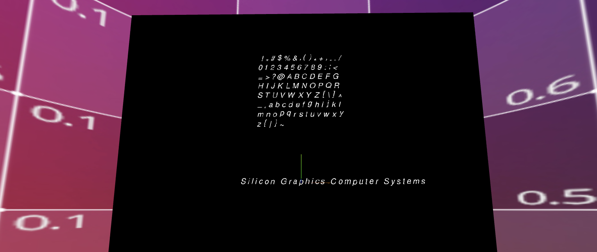

# sgi-fonts
*A collection of fonts from SGI systems and tools for rendering them.*

### [TXF fonts](txf) and [TXF viewer](txf-viewer)

### [Boot screen fonts](boot)

### [Popup menus](popup_menus)

